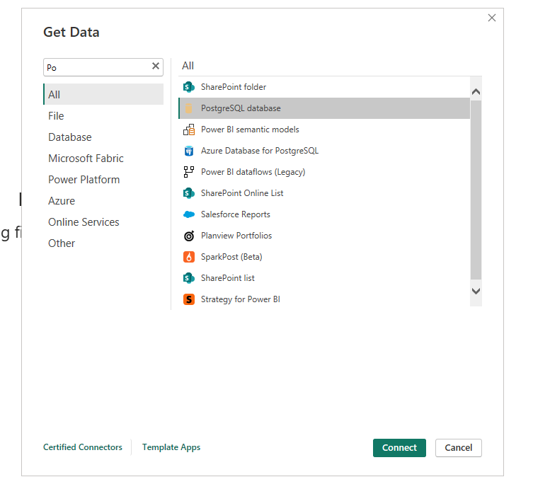
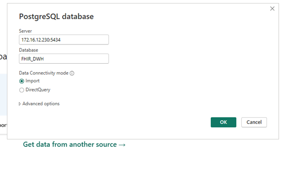
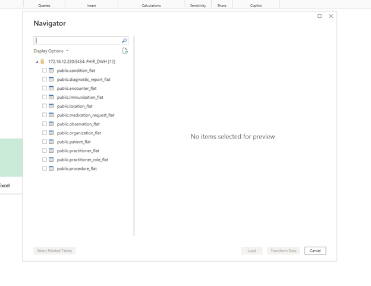
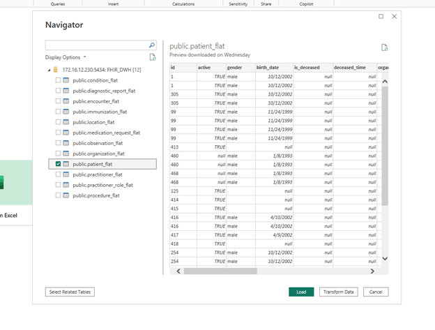

# Hướng dẫn mapping FHIR trên Power BI

**Tác giả:** Nguyễn Trường Phát  
**Email:** ntruongphat@lacviet.com.vn

Tài liệu này hướng dẫn cách kết nối Power BI đến cơ sở dữ liệu PostgreSQL phục vụ khai thác dữ liệu FHIR, đồng thời giới thiệu bảng dữ liệu mẫu để bắt đầu phân tích.

## 1. Kết nối nguồn dữ liệu

Trong Power BI, chọn nguồn dữ liệu **PostgreSQL database** để bắt đầu thiết lập kết nối.

*Hình 1. Chọn nguồn dữ liệu PostgreSQL*

## 2. Cấu hình thông tin kết nối

Nhập thông tin kết nối như sau:

| Thuộc tính | Giá trị |
| --- | --- |
| Server | 172.16.12.230:5434 |
| Database | FHIR_DWH |

Sau đó chọn **OK** để hoàn tất kết nối.

> Lưu ý: Kết nối chỉ khả dụng khi thiết bị được truy cập vào mạng Lạc Việt hoặc thông qua VPN nếu làm việc từ xa.

*Hình 2. Nhập thông tin kết nối*

## 3. Chọn bảng dữ liệu để khai thác

Sau khi kết nối thành công, chọn bảng **public.patient_flat** để khai thác và sử dụng dữ liệu trong Power BI.

*Hình 3. Chọn bảng dữ liệu cần khai thác*

Tiếp tục xác nhận để tải dữ liệu vào Power BI.

*Hình 4. Xác nhận và tiếp tục tải dữ liệu*
